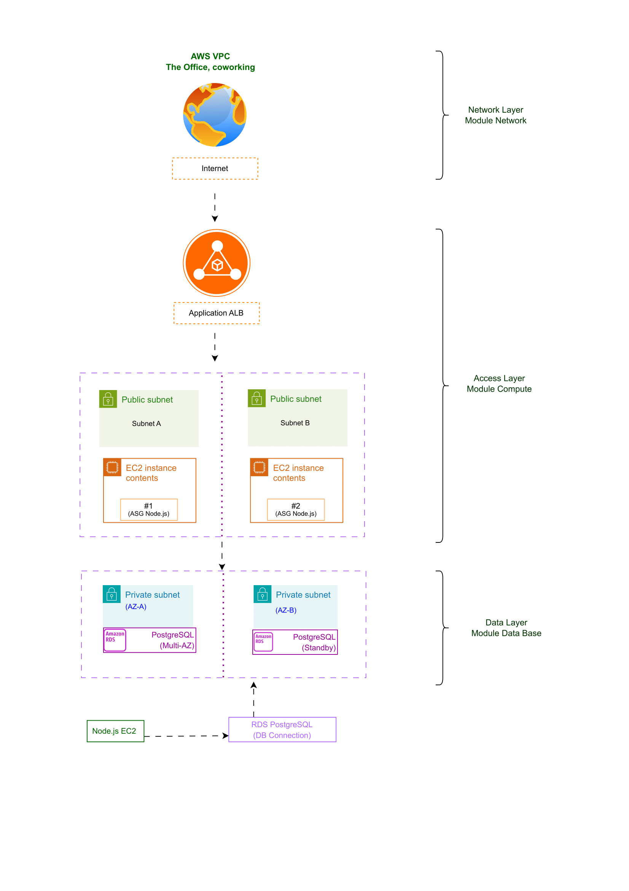
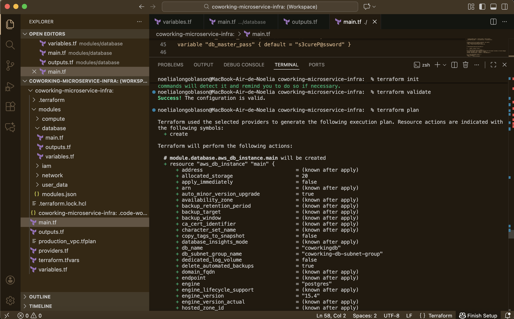

# 🏢 Coworking Microservice Infrastructure (MVP)

This repository contains the Terraform configuration files (Infrastructure as Code) for deploying the minimum viable product (MVP) infrastructure for a Coworking Space Login/Logout microservice.

The entire architecture is designed to be highly available (Multi-AZ), scalable (Auto Scaling Group), and secure (private database).

## 🗺️ Architecture Overview

The infrastructure follows a classic **Three-Tier Architecture** within a Virtual Private Cloud (VPC) in AWS.


### Key Components:

1.  **Networking Layer:** A secure Virtual Private Cloud (VPC) is created with separate Public and Private Subnets across two Availability Zones (AZs) for high availability.
2.  **Presentation/Compute Layer:** An Application Load Balancer (ALB) distributes incoming traffic (HTTP) across a managed Auto Scaling Group (ASG) of EC2 instances.
3.  **Data Layer:** An Amazon RDS PostgreSQL instance is deployed in the Private Subnets, ensuring it is not directly accessible from the internet.

## 🛠️ Project Structure (Modularity)

The project is divided into modular components to ensure reusability and maintainability.

| Module | Purpose | Key Resources |
| :--- | :--- | :--- |
| **`network`** | Core network setup. | VPC, Subnets, Internet Gateway, Route Tables. |
| **`database`** | Data persistence layer. | RDS PostgreSQL Instance, DB Subnet Group, DB Security Group (SG). |
| **`compute`** | Application hosting and scaling. | Application Load Balancer (ALB), Auto Scaling Group (ASG), EC2 Launch Template. |
| **`iam`** | Security and permissions. | IAM Role and Instance Profile for EC2 logging and AWS access. |

## 🚀 Deployment Instructions

### Prerequisites

1.  **Terraform:** Must be installed locally (v1.14+).
2.  **AWS Account:** Credentials configured locally (or exported as environment variables) with administrator permissions. (I did Sandbox- reference at the end)
3.  **Application Code:** The microservice code must be available (handled by the `user_data/app_startup.sh` script).

### Deployment Steps

1.  **Initialize Terraform:**
    ```bash
    terraform init
    ```
    *(This downloads the necessary AWS provider and initializes the modules.)*

2.  **Review the Execution Plan:**
    ```bash
    terraform plan
    ```
    *(Verify the output shows **23 resources to add**.)*

3.  **Apply the Infrastructure:**
    ```bash
    terraform apply
    ```
    *(Type `yes` when prompted to begin resource creation on your AWS account.)*

## 🗑️ Cleanup
To destroy all created resources and avoid incurring charges, use the destroy command:

```bash
terraform destroy
```

## 🔒 AWS Sandbox and Mock Credentials

Since this repository is a conceptual MVP designed for demonstration and educational purposes, it utilizes mock credentials and special provider flags to allow terraform init and terraform plan to execute locally without requiring valid AWS API keys.

This configuration allows the project to be verified and planned by anyone, but it will fail during terraform apply due to the lack of real authentication, which is expected behavior.

### Config###
Configuration in providers.tf (or main.tf):
Terraform

```bash 
provider "aws" {
  # ... other configurations ...

  # MOCK CREDENTIALS
  access_key = "mock_access_key" 
  secret_key = "mock_secret_key"

  # SKIP VALIDATION FLAGS
  skip_credentials_validation = true
  skip_requesting_account_id  = true
  skip_metadata_api_check     = true
}
```
## 🗺️ Architecture Overview

The infrastructure follows a classic **Three-Tier Architecture** within a Virtual Private Cloud (VPC) in AWS.

 

### Key Components:
...

# 🏢 Coworking Microservice Infrastructure Modules and Microservice (MVP)


**Módulo Data Base: Definition**

**Módulo Iam: Definition**

**Módulo User Data: Definition**

**Módulo Network: Definition**

**Módulo Compute: Definition**


**Microservice: Definition**


